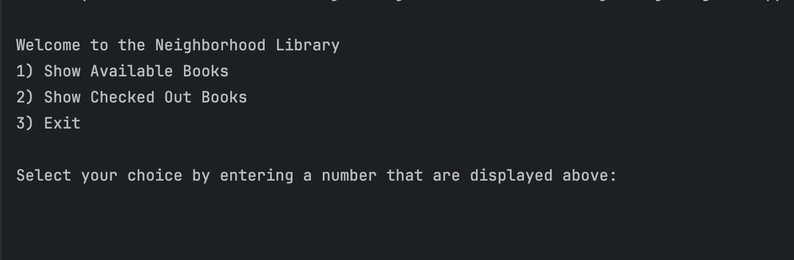
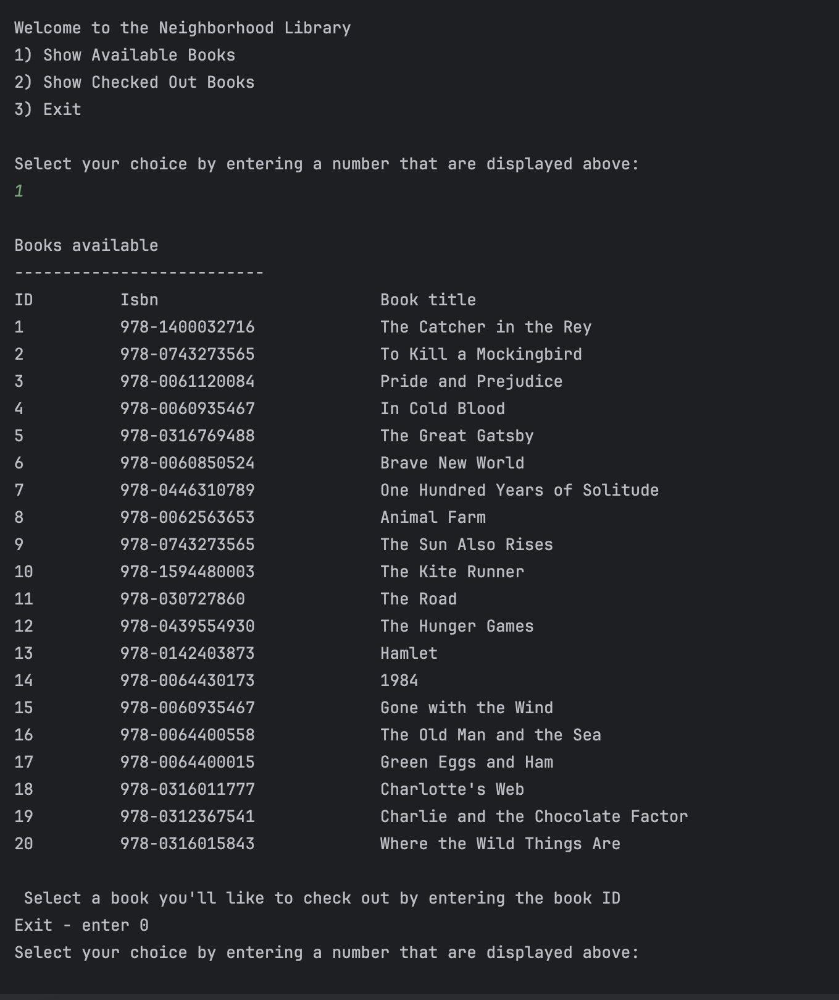

# neighborhood-library

The neightborhood library provides a digital Library platform for online reader who do not have access to libraries in their area or are unable to go to the library due to time or barries they might face.

In addition, the neightborhood libarary also provides a free platform in which allows individual to access books and free them on the financial barriers in having to pay out of pocket. 

Currently the Library offers 20 books for residents to choose from.

Books avaliable:

----id---- isbn:   ------------- Book title:
- 1, "978-1400032716", "The Catcher in the Rey"
- 2, "978-0743273565", "To Kill a Mockingbird"
- 3, "978-0061120084", "Pride andPrejudice"
- 4, "978-0060935467", "In Cold Blood"
- 5, "978-0316769488", "The Great Gatsby"
- 6, "978-0060850524", "Brave New World"
- 7, "978-0446310789", "One Hundred Years of Solitude", 
- 8, "978-0062563653", "Animal Farm"
- 9, "978-0743273565", "The Sun Also Rises"
- 10,"978-1594480003", "The Kite Runner"
- 11,"978-030727860",  "The Road"
- 12,"978-0439554930", "The Hunger Games"
- 13,"978-0142403873", "Hamlet"
- 14,"978-0064430173", "1984"
- 15,"978-0060935467", "Gone with the Wind"
- 16,"978-0064400558", "The Old Man and the Sea"
- 17,"978-0064400015", "Green Eggs and Ham"
- 18,"978-0316011777","Charlotte's Web"
- 19,"978-0312367541", "Charlie and the Chocolate Factor",
- 20,"978-0316015843", "Where the Wild Things Are"
----

First the resident will have the display of the front home Screen of the the neighborhood Library page.

In order to succesfully display my Neighborhood Library my thought process was to first display my home screen in my main class.

`public class Main
    public static void main(String[] args)
    {
    }`

And when succesfully executed I decided to create a sepreate function that calls the home screen display named homeScreenDisplay() inside of the public static void main(). 

The homeScreenDisplay function now takes in the resposible for displaying my home screen of the neighborhood Library and returing the user input. Requiring a interger being return when being called in the main method. 

     ` public static int homeScreenDisplay()
    {
        System.out.println();
        System.out.println("Welcome to the Neighborhood Library");
        System.out.println("1) Show Available Books");
        System.out.println("2) Show Checked Out Books");
        System.out.println("3) Exit");
        System.out.println();
        System.out.println("Select your choice by entering a number that are displayed above:");
        int userChoice = userInput.nextInt();
        userInput.nextLine();
        return userChoice;

    }`
    
--------------

Enter 1

In order to succesfully display books availablility I first sketch out an outline on how I want my book availablity to appear for the user. 

` public static void availableBookList(Book[] books)
    {
        System.out.println();
        System.out.println("Books available");
        System.out.println("----------------------------------------------------------");
        System.out.println("ID         Isbn                       Book title"); `

After that I begin writing want I want to accomplish and for this my thought process was to display books that are current not check out. 

In other words books that are not equal to true.
false = book avaliable
true = book not avaliable

When a book is not equal to true it is able to go inside the body of the if statment and print the book infomation. 

I only print the book Id, book isbn and book title.

    
        for (int i = 0; i < books.length; i++)
        {
            Book book = books[i];

            if (book.getisCheckedOut() != true)
            {
                System.out.printf("%-10d %-26s %-33s\n", book.getId(),
                        book.getIsbn(),
                        book.getTitle(),
                        book.getisCheckedOut(),
                        book.getCheckedOutTo());
            }
        }

Once I have that I want to know if the user would want to check out a book or return to the neighborhood library home page and for this I create a variable called bookChoice initialized to 0. 

int bookChoice = 0;

        System.out.println();
        System.out.println(" Select a book you'll like to check out by entering the book ID");
        System.out.println("Exit - enter 0");
        System.out.println("Select your choice by entering a number that are displayed above:");
        bookChoice = Integer.parseInt(userInput.nextLine());

Once I recieved the user choiceBook if a user inputs a number between 1 from 20 for 

if (bookChoice >= 1 && books.length >= bookChoice)
        {

            for (int i = 0; i < books.length; i++)
            {
                Book book = books[i];

                if (book.getId() == bookChoice)
                {
                    System.out.println("Enter your first name");
                    String userFirstName = userInput.nextLine().strip();
                    book.checkOut(userFirstName);
                    System.out.println();
                    System.out.println("Book checked out:");
                    System.out.println("ID         Isbn            Book title              Check out to:");
                    System.out.printf("%-5d %-15s %-30s %-10s \n", book.getId(), book.getIsbn(), book.getTitle(), book.getCheckedOutTo());
                }
            }
        }

Built with 
Java
